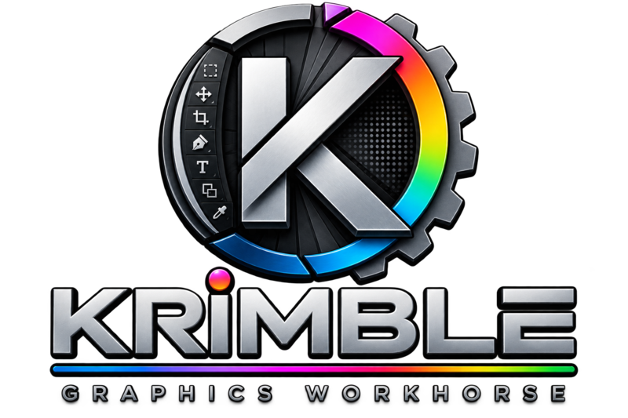

Krimble (formerly Krita Mobile) is a mobile-first fork of Krita designed to be a graphics workhorse for Android phones instead of a paint/animation app. The objective is to make a mobile version which is aware of the restrictions of limited screen real estate on mobile devices. Stripping away unnecessary UI components and scaling down others, creating new default behaviors that show awareness of mobile users needs, and making the UI a little more universal are objectives.

I am a lifelong professional artist trained with a wide range of traditional media and digital tools from Deluxe Paint to Photoshop to 3DS Max, Mudbox, ZBrush, et al. and to me trying to "paint" with a phone is about as appealing as writing a novel on a window with a bar of soap. However, I find myself using Krita on my smartphone as a daily driver for graphics tasks, so I am motivated to modify it for my own purposes. Sharing it, of course.

https://krimble.org

### Krita User Manual
https://docs.krita.org/en/user_manual.html

### Krita Development Notes and Build Instructions

Please follow [the online documentation](https://docs.krita.org/en/untranslatable_pages/building_krita.html).

Other developer guides, notes and wiki:

https://docs.krita.org/en/untranslatable_pages.html

APIdox:

https://api.kde.org/legacy/krita/html/index.html

### Bugs and Wishes

Wishlist:

1. Change default tool on open from paint tool to pan/hand tool. (see below)

2. Smaller splash image on load so it fits mobile screens. (DONE.)

3. Two finger move of any open window.

4. Remove Tools menu to make the Settings menu easier to reach. (DONE.)

5. Change Toolbox default sort order. (DONE. Pan tool given lowest `priority`/`toolBoxPriority` in `kis_tool_pan.cpp`. Also found and fixed a separate bug forcing the Brush tool active every time a pixel layer was selected, in `KisNodeManager::slotUiActivatedNode` — that logic is now disabled with a comment rather than forcing any tool.)

6. Disable autoload of file recovery on startup because mobile users don't tend to close apps with Quit/Exit. (DONE — already commented out in `KisApplication.cpp`: the `checkAutosaveFiles()` call that pops the recovery dialog on launch is inert. No other call site triggers it. Confirmed, no code change needed.)

7. Move Configure Krita menu and rename Preferences. (DONE. Preferences now lives under the Edit menu in `krita5.xmlgui`, matching Photoshop's placement.)

8. Reconfigure menus. (DONE. Full pass against Photoshop's actual menu bar (`krita5.xmlgui`): Select > Shrink renamed to Contract..., Layer > Merge Layer renamed to Merge Down, Filter menu categories remapped from Krita's own taxonomy (Artistic/Colors/Edge Detection/Emboss/Enhance/Map) to Photoshop's (Blur/Distort/Noise/Pixelate/Render/Sharpen/Stylize/Other), two dead menu categories with zero registered filters removed (Decor, Non-Photorealistic), and five color-adjustment filters — Index Colors, Posterize, Gradient Map, Palettize, Normalize — moved out of the Filter menu into Image > Adjustments to match where Photoshop puts them.)

9. Remove rotation from pinch zoom defaults. (DONE.)

10. Limit transform default to scaling. 

11. Limit move default to selected layer or floating selection until deliberately changed by user.

12. Implement industry standard terms for tools or menu items as needed. (DONE.)

13. Default to Snapping OFF. (DONE.)

14. Add zoom to 200% in menu. (DONE. TESTED. WORKS.)
    
15. Create custom default toolbar in imitation of classic toolbar. (DONE.)
    
16. Add the Adjust-Brightness/Contrast dialog (DONE. TESTED. WORKS.)

17. Widen sizing gadgets on windows and sections to make touchscreen resizing easier.

18. Rework the text/type tool, which is very hard to use currently. (Added menu to menubar, but more to come)

19. Create Krimble logo splash in case Krita org opposes use of "Krita" for new mobile version or use of AI in dev. (DONE.)

20. Rewrite larger dialogs windows to fit small screens.

21. Create new icon for mobile version. (DONE.)

22. Create Zoom 200% tool to match Zoom 100%. (DONE.)

23. Trim list of available save formats. (DONE.)

24. New icon. (DONE.)

25. Item 1 (default tool) had never actually been applied to code — the hardcoded call in `libs/ui/KisView.cpp` still forced `KritaShape/KisToolBrush` on every new view. Fixed to `PanTool` (hand tool) to match item 1. (DONE.)

26. Item 21/24 (new icon) only replaced `ic_launcher`/`ic_launcher_round` at every density. The app was still falling back to the separate `ic_launcher_next`/`ic_launcher_next_round` mipmaps AND the adaptive-icon foreground/background vector drawables (`ic_launcher_next_foreground.xml`, `ic_launcher_next_background.xml`), which still had the old placeholder Krita mark baked in as vector paths. All four Next-variant assets (mipmap webp x5 densities, plus the two adaptive vector drawables) now mirror the already-fixed regular assets. (DONE.)

27. `KRITA_ALPHA` flag was left set in `CMakeLists.txt`, which drove the "DEV BUILD" welcome-screen label. Commented out — this was the actual cause, confirmed on the build server (Qt5, `BUILD_WITH_QT6` was never enabled, defaults OFF). Originally suspected a Qt6-specific carve-out in `KritaVersionWrapper::isDevelopersBuild()` was involved; it wasn't, since the build has been Qt5 all along, but the carve-out was removed anyway so the check no longer depends on Qt major version. Decision: stick with Qt5 (Qt6 isn't production-ready upstream either). (DONE. Superseded in part by item 33 — `KRITA_ALPHA` was deliberately re-enabled once the build was actually versioned as an alpha, so the DEV BUILD label is back by design, not a regression.)

28. Splash screen still showed "Artwork by: Tyson Tan" — hardcoded in `libs/ui/kis_splash_screen.cpp` regardless of which splash image resource was actually loaded, so replacing the splash graphic alone never removed it. Cleared the credit string since Krimble's splash is an original asset. (DONE.)

29. Aligned every hardcoded keyboard shortcut default to Photoshop where a non-colliding key exists. Corrected ~200 shortcuts baked into `.action` XML files (which override the `photoshop_compatible.shortcuts` scheme when that scheme doesn't explicitly list them), synced the scheme file itself, and set `photoshop_compatible` as the default scheme in `kis_action_registry.cpp` instead of Krita's own `Default`. (DONE.)

30. Reassigned tool-selection shortcuts to match Photoshop exactly where possible: Move (V), Marquee (M/Shift+M), Lasso (L/Shift+L), Magic Wand/Similar (W/Shift+W), Crop (C), Eyedropper (I), Brush (B), Gradient (G), Pen (P), Type (T), Zoom (Z), Hand/Pan (H). Where a Krita-only global shortcut already held the letter Photoshop needed (brush opacity, brush color lighter, mirror canvas, MyPaint shade selector, instant preview mode, wrap-around mode, common colors), relocated those seven Krita-only actions to modifier-heavy combos instead of settling for an approximate tool key, so the exact Photoshop letter is free. Note: Photoshop cycles multiple tools under one key via repeated presses (e.g. Shift+M twice); Krimble's toolbox binds one key per tool with no cycling, so this is an exact-key match, not full cycling behavior. (DONE.)

31. Replaced "docker" with "panel" everywhere it appeared as user-facing text — menu labels, tooltips, dialog strings, translatable UI strings (18 files). Left internal class/widget/object names and the `plugins/dockers/` directory structure untouched since renaming those has no user-visible benefit and risks breaking signal/slot wiring. (DONE.)

32. Two-finger move of any open window/panel (see item 3) was scoped but intentionally not implemented — real conflict risk with canvas pan/zoom's own two-finger gesture handling, and the tool-cycling gap from item 30 both need a design decision before building. Deferred.

33. Version renumbered from Krita's inherited `5.4.0-prealpha` to Krimble's own `1.0.0-alpha1` in `CMakeLists.txt` (both the Qt5 and Qt6 branches, major/minor versions reset to 1/0). `KRITA_ALPHA` re-enabled since the build is now honestly alpha — this restores the "DEV BUILD" watermark on the welcome screen (see item 27's note). (DONE.)

34. Full pass replacing user-facing "Krita" references with "Krimble" — menus, dialogs, tooltips, About dialog, Android donation/IAP strings, ~35 files. Found and fixed the biggest miss: the actual Android app label in `AndroidManifest.xml` (home screen icon, app drawer, app switcher) was still "Krita" despite everything else being rebranded; also fixed the "Krita Next" build-flavor label to "Krimble Next". Deliberately preserved: historical `.kra` file-format version-compatibility notes (e.g. "Creamy (Krita 4.2+)") since those name real upstream milestones, not branding; the SVG/KRA XML namespace URI (`http://krita.org/namespaces/svg/krita`) and Qt's `organizationDomain("krita.org")` since those are internal identifiers, not user-facing text, and changing them risks breaking file-format compatibility; code comments citing real upstream KDE commit URLs for bug-fix attribution; and the welcome page's paragraph crediting real Krita's actual contributors/sponsors/development fund (skipped on request — text there still says "Krita"). (DONE.)

35. All real krita.org/docs.krita.org/krita-artists.org links replaced: donation links now point to buymeacoffee.com/GeorgeEdwardPurdy, the Source Code link on the welcome page now points to the real Krimble GitHub repo instead of Krita's, and everything else (manual, community, scripting school, bug-report guide, RSS news feeds) points to krimble.org as a placeholder pending those actually being built. (DONE.)

36. About dialog claimed "The Krimble Foundation and its projects on krita.org are committed to preserving Krimble as free software" — a leftover from an earlier partial edit that invented a nonexistent legal entity. Replaced with "The Krimble Project is committed to preserving Krimble as free software." (DONE.)

### Krita Project Website

https://www.krita.org

### License

Krita as a whole is licensed under the GNU Public License, Version 3. Individual files may have a different, but compatible license.

### AI

Krita development has a moratorium on use of AI.

I don't, and I'm more of an anarchist, so I'll do whatever I think works. Is it likely to cause problems? Yes.

Move fast and break things.

